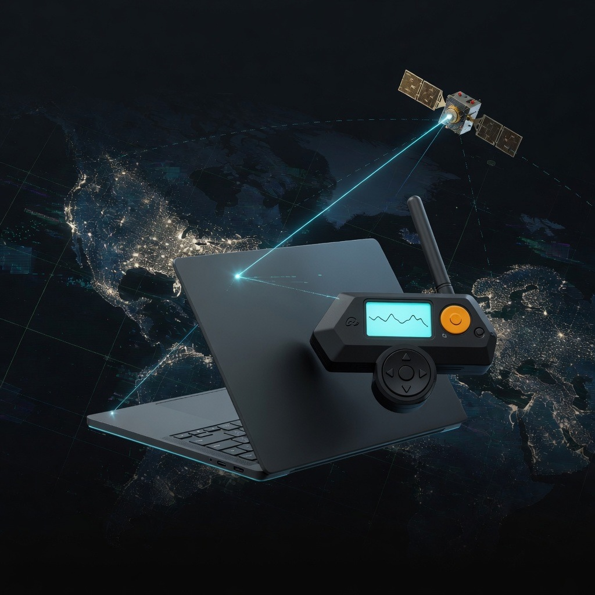
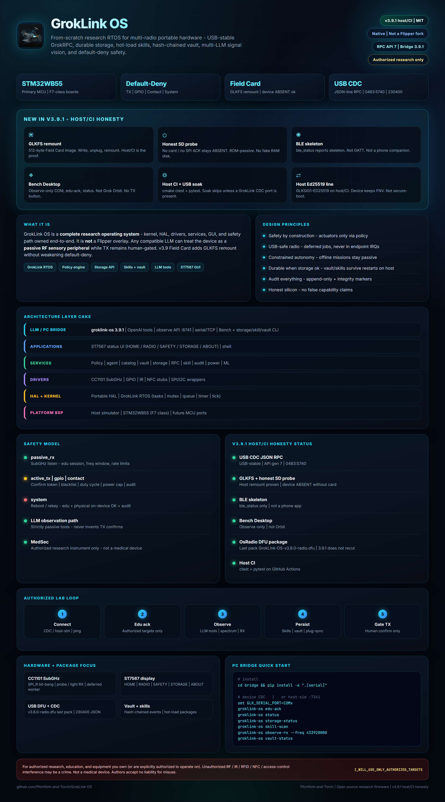
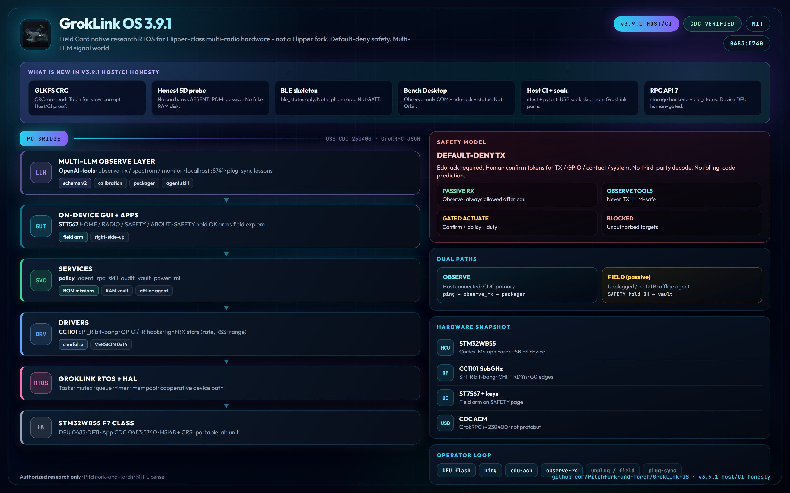

# GrokLink OS

<p align="center">
  
</p>

<p align="center"><strong>From-scratch research RTOS for portable multi-radio hardware.</strong></p>

[](LICENSE)
[](VERSION)
[](https://github.com/Pitchfork-and-Torch/GrokLink-OS/releases/latest)

> **Not an overlay, not a fork, and not a patch** on official Flipper Zero / Momentum / Unleashed firmware.
> GrokLink OS owns its kernel, HAL, drivers, services, GUI, and safety path end-to-end.
> Prior product ([GrokLink-Firmware](https://github.com/Pitchfork-and-Torch/GrokLink-Firmware) v2.x) was a Furi overlay.

---

## LEGAL / ETHICAL WARNING

For **authorized research, education, and equipment you own** (or are explicitly authorized to operate on).

Unauthorized access to RF / IR / RFID / NFC / access-control / vehicle systems may be a crime.
Authors accept **no liability** for misuse.

- **TX**, **GPIO drive**, **contact**, and **system** actions are **default-deny**.
- Confirm tokens, blacklists, duty limits, and append-only audit logs are mandatory.
- **Not a medical device** - never for diagnosis, treatment, care monitoring, or patient-connected use.
- **MedSec** = authorized research / facility RF instrument under written RoE (see [docs/HEALTHCARE_OPERATOR_RUNBOOK.md](docs/HEALTHCARE_OPERATOR_RUNBOOK.md)).
- Profile **`medsec-strict`** forbids all TX (passive only).
- **No third-party remote decode** or rolling-code prediction tooling.

Education phrase:

```text
I_WILL_USE_ONLY_AUTHORIZED_TARGETS
```

---

## Latest: v3.8.0 - Storage, Skills & Persistent Autonomy

Built on the **v3.7 USB-stable field unit** + MedSec instrument pack.

| Area | Status |
|------|--------|
| USB CDC JSON GrokRPC | **Stable** (API **6**) - USB-first boot, light RPC in RX callback |
| **Storage stack** | Crash-safe layout, degraded modes, host-sim first-class - [docs/STORAGE.md](docs/STORAGE.md) |
| **Hot-load skills** | SD scan + ROM fallback; optional `GLKSIG1` package verify hook |
| **Persistent vault** | Hash-chained durable events; optional operator seal; plug-sync ready |
| **Spectrum planner** | Min settle, duty budget, arbiter, circuit breaker (non-bypassable) |
| Agent resume + power defer | `state/mission_*.resume`; battery / deep_sleep aware |
| On-device GUI | ST7567: HOME / RADIO / SAFETY / **STORAGE** / ABOUT |
| Policy default-deny TX | Live (+ storage/vault op gates) |
| Multi-LLM signal observability | Live host bridge (observe tools, schema v2) - **passive only** |
| Lab Codec (GLK1) | Owned-lab beacon encode/decode education only |
| ROM passive missions | Always available without SD (incl. MedSec) |
| MedSec packs + lab evidence CLI | Passive skills/missions; `groklink-os lab *` |

Release notes: [release-notes-v3.8.0.md](release-notes-v3.8.0.md)  |  Roadmap: [docs/ROADMAP_3.7.md](docs/ROADMAP_3.7.md)  |  MedSec: [docs/MEDSEC_WORLDWIDE_NEXT_STEPS.md](docs/MEDSEC_WORLDWIDE_NEXT_STEPS.md).

### MedSec quick path

```powershell
groklink-os edu-ack
groklink-os lab medsec-demo
groklink-os lab engagement-init --operator lab-op1 --engagement ENG-001 --site bench --roe-ack
groklink-os lab casefile --dir cases/ENG-001 --title "passive baseline" --hypothesis "quiet ISM"
```

---

## Architecture

<p align="center">
  
</p>

<p align="center">
  
</p>

```
PC bridge (groklink-os)
        | USB CDC 230400
        v
+-----------------------------------------+
| GUI (ST7567)  |  Apps                     |
| Services: policy  |  agent  |  rpc  |  skill  |
|           audit  |  storage  |  power  |  ml  |
| Drivers: CC1101 SubGHz  |  gpio  |  ir ...  |
| GrokLink RTOS kernel + HAL              |
| BSP: host sim | stm32wb55 (F7 class)    |
+-----------------------------------------+
```

Field report (v3.7.0 silicon): [docs/lab/FIELD_REPORT_v3.7.0.md](docs/lab/FIELD_REPORT_v3.7.0.md)

---

## Flash (device)

1. Enter DFU: unplug, hold **BACK + OK**, plug USB -> **DFU in FS Mode** (`0483:DF11`).
2. Flash latest DFU from [Releases](https://github.com/Pitchfork-and-Torch/GrokLink-OS/releases/latest):

```powershell
.\tools\flash_os_dfu_only.ps1 -DfuPath dist\dfu\GrokLink-OS-v3.8.0-radio.dfu
# or: qFlipper-cli firmware path\to\GrokLink-OS-v3.8.0-radio.dfu
```

3. After reboot: USB Serial (`0483:5740`) @ **230400**. qFlipper protobuf errors after flash are expected.

```powershell
groklink-os ping
groklink-os edu-ack
groklink-os status
```

Recover stock Flipper / lab overlay: `.\tools\recover_flipper.ps1`

Detail: [docs/FLASH_LATEST.md](docs/FLASH_LATEST.md)  |  [docs/QFLIPPER_AND_WINDOWS.md](docs/QFLIPPER_AND_WINDOWS.md)

---

## Quick start (host bridge)

```powershell
git clone https://github.com/Pitchfork-and-Torch/GrokLink-OS.git
cd GrokLink-OS/bridge
py -3 -m pip install -e ".[serial]"
# $env:GLK_SERIAL_PORT = "COMx"
groklink-os ping
groklink-os edu-ack
groklink-os observe-rx --freq 433920000 --ms 400
```

Unplugged field (passive only):

```powershell
groklink-os prepare-unplugged --id lab_passive_watch
# or on device: SAFETY page, hold OK ~2s
# on reconnect:
groklink-os plug-sync --clear-vault
```

---

## Docs

| Doc | Topic |
|-----|--------|
| [ARCHITECTURE.md](docs/ARCHITECTURE.md) | Stack overview |
| [SAFETY.md](docs/SAFETY.md) | Policy model |
| [SIGNAL_OBSERVABILITY.md](docs/SIGNAL_OBSERVABILITY.md) | Multi-LLM observe schema |
| [UNPLUGGED_AUTONOMY.md](docs/UNPLUGGED_AUTONOMY.md) | Offline agent |
| [PLUG_SYNC_RESEARCH.md](docs/PLUG_SYNC_RESEARCH.md) | Reconnect ingest |
| [LAB_CODEC.md](docs/LAB_CODEC.md) | GLK1 education |
| [ROADMAP_3.7.md](docs/ROADMAP_3.7.md) | 3.7.x / 3.8 plan |
| [BUILD.md](docs/BUILD.md) | Toolchain / DFU build |

Agent skill: `agent-skill/groklink-os/`

---

## Support the work

GrokLink OS is **free and open source**. Bug reports and feature requests are welcome via [GitHub Issues](https://github.com/Pitchfork-and-Torch/GrokLink-OS/issues).

## License

MIT - see [LICENSE](LICENSE).
